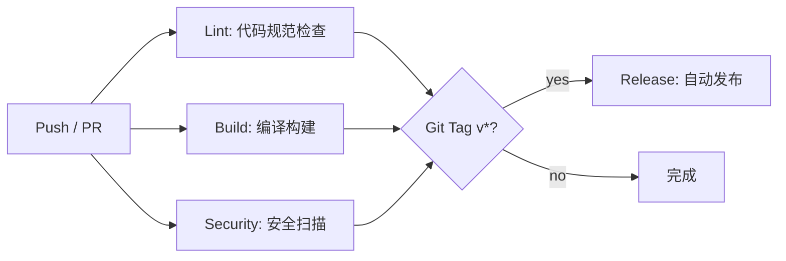

<p align="center">
  
  
  
  
  
  
  
  
</p>

<h1 align="center">⚔ ZUUL — 失落的古迹 ⚔</h1>

<p align="center">
  <em>一款基于 Web 的 Roguelike 地牢探险游戏</em><br>
  <strong>深入迷宫，探寻被遗忘的秘密</strong>
</p>

<p align="center">
  <a href="#-项目简介">项目简介</a> •
  <a href="#-核心功能">核心功能</a> •
  <a href="#-技术栈">技术栈</a> •
  <a href="#-系统架构">系统架构</a> •
  <a href="#-代码规范">代码规范</a> •
  <a href="#-cicd-流水线">CI/CD 流水线</a> •
  <a href="#-快速开始">快速开始</a> •
  <a href="#-项目结构">项目结构</a> •
  <a href="#-开发团队">开发团队</a>
</p>

---

## 📖 项目简介

**ZUUL — 失落的古迹** 是一个基于经典文本冒险游戏 *World of Zuul* 扩展开发的图形化 Roguelike 地牢探险游戏。玩家将扮演一位勇敢的探险者，穿越程序随机生成的迷宫，与神秘的怪物战斗，收集强大的魔法物品，并在篝火处恢复体力、提升能力，最终揭示隐藏在废墟中的真相。

本项目为 **武汉理工大学软件工程实训** 小组协同开发任务，旨在通过实践巩固软件工程规范、提高面向对象建模与抽象能力、培养小组协同开发能力。

> **游戏 motto**: *"勇气是人类最伟大的赞歌。"*

---

## ✨ 核心功能

### 🎮 游戏玩法
| 功能 | 说明 |
|------|------|
| **随机地图生成** | 每次游戏生成独特的 10×15 房间网格（约 30-50 个房间），7 种房间类型 |
| **实时战斗系统** | WASD 移动、J 攻击/长按蓄力、Shift+方向+J 突刺、H 月光波（消耗20MP，弹射2次）、F 风隐（移速+100%免疫debuff，每秒消耗2MP）、G 寒冰风暴（消耗25MP，全房间3次法伤+迟缓） |
| **三种攻击模式** | 扇形扫击（半径120px/135°）、直线突刺（21px宽）、蓄力攻击（半径150px/360°） |
| **多种怪物类型** | 普通怪物（TYPE_NORMAL=0）、精英怪物（TYPE_ELITE=1，带特殊减益）、Boss（TYPE_BOSS=2） |
| **特殊怪物** | 火焰史莱姆（FLAME_SLIME，死后自爆烧伤）、史莱姆（SLIME，触碰迟缓缓慢）、骷髅（攻击附加2层中毒）、狼人（攻击间隔0.6s附加2层流血）、食人魔（攻击间隔2s，50%吸血回复） |
| **状态效果系统** | 烧伤（每3秒火焰伤害）、中毒（每秒真实伤害）、流血（攻击触发伤害）、迟缓（10秒移速减半，不可叠加）、束缚（3秒无法移动/突刺） |
| **背包系统** | 消耗品按名称合并数量显示，装备/饰品每个独立占位，支持装备/卸下/丢弃操作 |
| **装备系统（5槽位）** | 武器（铁剑+15攻击）、护甲（铁盾+10防御）、披风（暗影披风+15闪避/+20速度）、戒指（生命戒指+50HP/每2秒回血）、项链（元素项链+15魔攻/+20魔抗） |
| **商店系统** | 购买/出售物品，商店随机生成6件商品，出售价为买价的一半 |
| **篝火祭坛** | 治愈祭坛（回复50%HP/MP）、训练祭坛（+25%攻击/+10魔抗）、博学祭坛（从3个恩赐中选择1个）|
| **8种智慧恩赐** | 坚忍(+30%HP)、浩瀚(+50%MP)、整备(+15防御)、守护(+25魔抗)、强健(+15攻击)、博学(+25魔攻)、敏捷(+50速度)、灵动(+25闪避) |
| **月光波技能** | 消耗20MP，弹射2次，单体魔法攻击，带击退效果 |
| **风隐形态** | 蓄力1秒开启，移速+100%、免疫负面状态，每秒消耗2MP |
| **寒冰风暴** | 消耗25MP，全房间AOE，3次100%法伤+10秒迟缓 |
| **奇遇事件系统** | 宝箱(木箱75-150g/金箱999g)、喷泉(血换钱/钱换血)、精英敌人、铁匠(装备150%强化)、天使(30s全属性×1.5)、少女(满血回复) |
| **怪物掉落** | 击败怪物掉落货币，Boss/精英掉落稀有装备 |
| **存档系统** | H2 数据库持久化，支持保存/读取/删除，保存全部游戏状态（房间/怪物/背包/玩家） |

### 🏠 房间类型
| 类型 | 说明 |
|------|------|
| **START_HALL** | 起始大厅，玩家初始位置 |
| **SHOP** | 商人房间，可购买/出售物品（6件随机商品） |
| **ENCOUNTER** | 奇遇事件房间（宝箱/喷泉/精英敌人等） |
| **CAMPFIRE** | 篝火休息点，包含治愈/训练/博学三种祭坛 |
| **BOSS** | Boss 战房间 |
| **ELITE_MONSTER** | 精英怪物房间（1-2只精英） |
| **NORMAL_MONSTER** | 普通怪物房间（1-3只普通怪），击败后解锁出口 |

### 👤 玩家初始属性
| 属性 | 初始值 |
|------|--------|
| 生命值 (HP) | 100 |
| 魔力值 (MP) | 100 |
| 物理攻击 | 20 |
| 魔法攻击 | 15 |
| 物理防御 | 10 |
| 魔法抗性 | 0 |
| 移动速度 | 100 |
| 闪避率 | 0 |
| 金钱 | 50 |

### 📦 物品一览
| 名称 | 类型 | 价格 | 效果 |
|------|------|------|------|
| 生命浆果 | 消耗品 | 25g | 回复25点生命值 |
| 魔力浆果 | 消耗品 | 25g | 回复25点魔力值 |
| 饼干 | 消耗品 | 40g | 最大生命值+10 |
| 药水 | 消耗品 | 35g | 回复20HP + 30MP |
| 铁剑 | 武器 | 80g | 物理攻击力+15 |
| 铁盾 | 护甲 | 70g | 物理防御力+10 |
| 暗影披风 | 披风 | 200g | 闪避率+15%，移速+20 |
| 生命戒指 | 戒指 | 150g | 最大HP+50，每2秒恢复1HP |
| 元素项链 | 项链 | 150g | 魔攻+15，魔抗+20 |

---

## 🛠 技术栈

### 后端 (Backend)
| 技术 | 版本 | 用途 |
|------|------|------|
| **Java** | 17 | 编程语言 |
| **Spring Boot** | 3.2.0 | Web 框架 |
| **Spring Data JPA** | — | 持久化层 |
| **H2 Database** | — | 嵌入式数据库 |
| **Maven** | — | 项目构建与管理 |
| **Lombok** | — | 代码简化 |

### 前端 (Frontend)
| 技术 | 版本 | 用途 |
|------|------|------|
| **Vue 3** | 3.3.4 | 前端框架 |
| **Phaser 3** | 3.60.0 | 游戏引擎 |
| **Vite** | 5.0.0 | 构建工具 |
| **Pinia** | 2.0.33 | 状态管理 |

### 开发工具与流程
| 工具 | 用途 |
|------|------|
| **IntelliJ IDEA** | 后端开发 IDE |
| **VS Code** | 前端开发 IDE |
| **GitHub** | 代码仓库与协同开发 |
| **GitHub Issues** | 任务管理与分配 |
| **GitHub Actions** | CI/CD 自动化流水线（Lint / Build / Security / Release） |
| **ESLint + Prettier** | 前端代码规范检查（Vue/JS） |
| **Checkstyle** | 后端 Java 代码规范检查 |
| **Commitlint** | 提交信息规范检查（Conventional Commits） |
| **Postman** | API 测试 |

---

## 🏗 系统架构

```
┌─────────────────────────────────────────────────────────────┐
│                    Frontend (Vue 3 + Phaser 3)              │
│  ┌──────────┐  ┌──────────┐  ┌──────────┐  ┌──────────┐   │
│  │ MainMenu │  │GameCanvas│  │BackpackUI│  │ Minimap  │   │
│  │   (Vue)  │  │ (Phaser) │  │   (Vue)  │  │ (Canvas) │   │
│  └────┬─────┘  └────┬─────┘  └────┬─────┘  └────┬─────┘   │
│       └──────────────┼──────────────┼──────────────┘        │
│                      │   HTTP REST API (JSON)               │
└──────────────────────┼──────────────────────────────────────┘
                       │
┌──────────────────────┼──────────────────────────────────────┐
│                      ▼                                      │
│  Backend (Spring Boot 3.2.0)                                │
│  ┌──────────────────────────────────────────────────────┐   │
│  │              GameController (REST API)               │   │
│  │  GET /api/game  POST /api/command  POST /api/attack  │   │
│  │  POST /api/reset  GET /api/map  GET /api/backpack    │   │
│  │  POST /api/save  POST /api/load  GET /api/saves      │   │
│  │  POST /api/deleteSave                                │   │
│  │  POST /api/windcloak/activate                        │   │
│  │  POST /api/windcloak/deactivate                      │   │
│  │  POST /api/icestorm                                  │   │
│  └──────────────────────┬───────────────────────────────┘   │
│                          │                                    │
│  ┌──────────────────────┴───────────────────────────────┐   │
│  │  GameService                                         │   │
│  │  命令分发 · 玩家状态注入 · 攻击空间判定              │   │
│  │  风隐技能 · 寒冰风暴技能 · 状态效果驱动              │   │
│  └──────────────────────┬───────────────────────────────┘   │
│                          │                                    │
│  ┌──────────────────────┴───────────────────────────────┐   │
│  │              Game (核心游戏逻辑)                       │   │
│  │  Room / Player / Monster / Item / Bag / Combat       │   │
│  │  状态效果(烧伤/中毒/流血/迟缓/束缚/天使) · 装备系统  │   │
│  │  怪物AI(史莱姆/骷髅/狼人/食人魔特殊机制)            │   │
│  └──────────────────────┬───────────────────────────────┘   │
│                          │                                    │
│  ┌──────────────────────┴───────────────────────────────┐   │
│  │            Repository Layer (Spring Data JPA)         │   │
│  │  GameSaveRepo / RoomStateRepo / MonsterStateRepo     │   │
│  │  BagItemRepo / ShopStateRepo                         │   │
│  └──────────────────────┬───────────────────────────────┘   │
│                          │                                    │
│  ┌──────────────────────┴───────────────────────────────┐   │
│  │               H2 Database (嵌入式)                    │   │
│  └──────────────────────────────────────────────────────┘   │
└──────────────────────────────────────────────────────────────┘
```

### API 接口一览

| 方法 | 路径 | 说明 |
|------|------|------|
| `GET` | `/api/game` | 获取当前游戏状态 |
| `POST` | `/api/command` | 执行游戏命令 |
| `POST` | `/api/attack` | 执行玩家攻击（3种攻击模式） |
| `POST` | `/api/reset` | 重置游戏 |
| `POST` | `/api/save` | 保存游戏（请求体含 saveId） |
| `POST` | `/api/load` | 加载存档（请求体含 saveId） |
| `GET` | `/api/saves` | 获取存档列表 |
| `POST` | `/api/deleteSave` | 删除存档 |
| `POST` | `/api/windcloak/activate` | 激活风隐形态 |
| `POST` | `/api/windcloak/deactivate` | 解除风隐形态 |
| `POST` | `/api/icestorm` | 释放寒冰风暴（全房间AOE） |
| `GET` | `/api/map` | 获取全地图数据 |
| `GET` | `/api/backpack` | 获取背包物品列表 |

> 完整的 API 文档请参见 [`API.md`](API.md)。

---

## 📐 代码规范

项目引入了多层次的代码规范检查体系，所有代码在合并到 master 前必须通过规范检查。

### 前端规范（ESLint + Prettier）

| 配置 | 文件 | 说明 |
|------|------|------|
| **ESLint** | [`frontend/.eslintrc.cjs`](frontend/.eslintrc.cjs) | Vue 3 + JavaScript 代码规范规则 |
| **Prettier** | [`frontend/.prettierrc`](frontend/.prettierrc) | 代码格式化规则（singleQuote、无分号、printWidth 100） |
| **ESLint Ignore** | [`frontend/.eslintignore`](frontend/.eslintignore) | ESLint 忽略配置 |
| **Prettier Ignore** | [`frontend/.prettierignore`](frontend/.prettierignore) | Prettier 忽略配置 |

执行检查：

```bash
cd frontend && npx eslint src/ --max-warnings=200
```

### 后端规范（Checkstyle）

| 配置 | 文件 | 说明 |
|------|------|------|
| **Checkstyle** | [`backend/checkstyle.xml`](backend/checkstyle.xml) | Java 代码规范（基于 Google Style 简化版） |
| **Maven 集成** | [`backend/pom.xml`](backend/pom.xml) | 通过 `maven-checkstyle-plugin` 在 verify 阶段执行 |

执行检查：

```bash
cd backend && mvn validate
```

### 提交信息规范（Commitlint）

| 配置 | 文件 | 说明 |
|------|------|------|
| **Commitlint** | [`commitlint.config.cjs`](commitlint.config.cjs) | Conventional Commits 规范 |

**支持的类型**: `feat`（新功能） / `fix`（修复） / `docs`（文档） / `style`（样式） / `refactor`（重构） / `test`（测试） / `chore`（杂项） / `ci`（CI配置） / `perf`（性能优化）

**提交格式**: `<type>: <description>`，如 `feat: add attack system`、`ci: add lint workflow`

---

## 🔄 CI/CD 流水线

项目通过 GitHub Actions 实现了完整的持续集成与部署流水线，所有配置文件位于 [`.github/workflows/`](.github/workflows/)。

### 流水线概览



### 工作流说明

| 工作流 | 文件 | 触发条件 | 检查内容 |
|--------|------|----------|----------|
| **🔍 Lint** | [`lint.yml`](.github/workflows/lint.yml) | push / pull_request (main) | ESLint + Prettier + Checkstyle + Commitlint |
| **🏗️ Build** | [`build.yml`](.github/workflows/build.yml) | push / pull_request (main) | 前端 `npm run build` + 后端 `mvn verify` + 上传构建产物 |
| **🛡️ Security** | [`security.yml`](.github/workflows/security.yml) | push / pull_request (main) | CodeQL 安全扫描（JavaScript + Java） |
| **📦 Release** | [`release.yml`](.github/workflows/release.yml) | git tag v* (main) | 自动构建全项目 → 打包 ZIP → 发布到 GitHub Releases |

### 发布流程

1. 在 master 分支上打版本标签并推送：
   ```bash
   git checkout master
   git tag v1.0.0
   git push origin --tags
   ```
2. Release 工作流自动触发，完成构建与打包。
3. 发布包（ZIP）上传到 GitHub Releases 页面，包含：
   - `backend/target/*.jar` — 后端可执行 JAR
   - `frontend/dist/` — 前端静态资源

### 代码审查流程

- **PR 模板**: [`PULL_REQUEST_TEMPLATE.md`](.github/PULL_REQUEST_TEMPLATE.md) — 所有 PR 需填写类型、检查清单
- **CODEOWNERS**: [`.github/CODEOWNERS`](.github/CODEOWNERS) — 自动指派 @xjs69 为审核人
- **分支保护**: master 分支启用保护规则，要求 PR 审查、状态检查通过
- **变更日志**: [`CHANGELOG.md`](CHANGELOG.md) — 记录每个版本的更新内容

---

## 🚀 快速开始

### 环境要求

- **JDK 17+**
- **Node.js 18+**
- **Maven 3.8+**

### 1. 启动后端

```bash
# 进入后端目录
cd backend

# 使用 Maven 编译并启动
mvn spring-boot:run
```

后端服务默认启动在 `http://localhost:8080`。

### 2. 启动前端

```bash
# 进入前端目录
cd frontend

# 安装依赖
npm install

# 启动开发服务器
npm run dev
```

前端开发服务器默认启动在 `http://localhost:5173`，并自动代理 `/api` 请求到后端。

### 3. 开始游戏

在浏览器中打开 `http://localhost:5173`，点击 **"开始游戏"** 即可进入冒险！

---

## 📁 项目结构

```
kai-fa-aaa603/
├── README.md                 # 项目介绍文档（本文件）
├── API.md                    # API 接口文档
├── REPORT.docx               # 小组实训报告
├── backend/                  # 后端项目 (Spring Boot + Maven)
│   ├── pom.xml               # Maven 依赖配置
│   ├── src/main/java/.../zuul/
│   │   ├── Game.java         # 游戏核心逻辑
│   │   ├── GenerateRoom.java # 随机地图生成器
│   │   ├── ZuulApplication.java # Spring Boot 启动类
│   │   ├── command/          # 命令处理类
│   │   │   ├── GoCommand.java      # 移动命令
│   │   │   ├── AttackCommand.java  # 攻击命令
│   │   │   ├── BagCommand.java     # 背包操作（use/unequip/discard/take）
│   │   │   ├── ShopCommand.java    # 商店操作（buy/sell）
│   │   │   ├── InteractCommand.java # 交互（祭坛/奇遇/铁匠）
│   │   │   ├── WaveCommand.java    # 月光波技能
│   │   │   ├── PickupCommand.java  # 拾取物品
│   │   │   ├── DropCommand.java    # 丢弃物品
│   │   │   ├── ItemsCommand.java   # 查看物品
│   │   │   ├── MonsterAttackCommand.java # 怪物攻击
│   │   │   └── Command.java        # 命令接口
│   │   ├── controller/       # REST 控制器
│   │   │   └── GameController.java # 13个API端点（含风隐/寒冰风暴）
│   │   ├── model/            # 数据模型
│   │   │   ├── Room.java         # 房间（7种类型、祭坛/商店/事件初始化）
│   │   │   ├── Player.java       # 玩家（装备系统5槽位、伤害计算）
│   │   │   ├── Monster.java      # 怪物（3种类型+火焰史莱姆）
│   │   │   ├── Bag.java          # 背包（消耗品合并/装备独立）
│   │   │   ├── Item.java         # 物品
│   │   │   ├── ItemRegistry.java # 物品注册表（9种注册物品）
│   │   │   ├── Status.java       # 状态效果（烧伤/中毒/流血/迟缓/束缚/天使）
│   │   │   ├── WisdomBoon.java   # 智慧恩赐（8种）
│   │   │   ├── Magic.java        # 魔法伤害计算
│   │   │   ├── Money.java        # 货币系统
│   │   │   ├── RoomType.java     # 房间类型枚举
│   │   │   ├── Altar.java        # 祭坛
│   │   │   ├── AltarType.java    # 祭坛类型枚举
│   │   │   ├── AttackRequest.java # 攻击请求DTO
│   │   │   ├── RandomEvent.java  # 随机事件
│   │   │   ├── RandomEventType.java # 事件类型枚举
│   │   │   ├── ShopItem.java     # 商店商品
│   │   │   ├── DroppedItem.java  # 掉落物
│   │   │   ├── InventoryItem.java # 背包物品DTO
│   │   │   └── GameResponse.java # 统一响应格式
│   │   ├── repository/       # 数据持久层（JPA Repository）
│   │   │   ├── GameSaveRepository.java
│   │   │   ├── RoomStateRepository.java
│   │   │   ├── MonsterStateRepository.java
│   │   │   ├── BagItemRepository.java
│   │   │   └── ShopStateRepository.java
│   │   └── service/          # 业务服务层
│   │       ├── GameService.java  # 核心游戏服务（命令分发/攻击判定/风隐/寒冰风暴/状态驱动）
│   │       └── SaveService.java  # 存档服务
│   └── src/main/resources/
│       └── application.properties
├── frontend/                 # 前端项目 (Vue 3 + Vite)
│   ├── index.html
│   ├── package.json
│   ├── vite.config.js
│   └── src/
│       ├── App.vue           # 主应用组件（含存档弹窗）
│       ├── main.js           # 入口文件
│       ├── index.css         # 全局样式
│       ├── api/gameApi.js    # 后端 API 封装（存档CRUD）
│       ├── components/
│       │   ├── MainMenu.vue      # 主菜单界面
│       │   ├── GameCanvas.vue    # 游戏主画布 (Phaser 3引擎)
│       │   ├── BackpackPanel.vue # 背包面板
│       │   ├── ControlPanel.vue  # 控制面板（ESC打开/关闭）
│       │   └── MinimapPanel.vue  # 小地图独立组件
│       ├── composables/
│       │   ├── useApi.js        # API调用封装
│       │   ├── useBackpack.js   # 背包逻辑
│       │   ├── useKeyboard.js   # 键盘控制
│       │   ├── useControlPanel.js # 控制面板单例
│       │   └── useSlotDialog.js # 存档弹窗逻辑
│       ├── entity/
│       │   └── EntityDrawer.js  # 游戏实体绘制器（人物/怪物/掉落物/祭坛/商人）
│       └── game/
│           └── constants.js     # 游戏全局常量（攻击/技能/怪物/渲染配置）
├── .github/                  # GitHub 配置（CI/CD + 模板）
│   ├── workflows/
│   │   ├── lint.yml          # 代码规范检查（ESLint + Checkstyle + Commitlint）
│   │   ├── build.yml         # 编译构建与产物上传
│   │   ├── security.yml      # CodeQL 安全扫描
│   │   └── release.yml       # GitHub Release 自动发布
│   ├── PULL_REQUEST_TEMPLATE.md  # PR 模板
│   └── CODEOWNERS            # 代码审核人自动指派
├── .editorconfig             # 编辑器统一配置（UTF-8 / LF / 缩进规则）
├── commitlint.config.cjs     # 提交信息规范（Conventional Commits）
├── CHANGELOG.md              # 版本变更日志
├── plans/                    # 开发计划与设计文档
│   ├── code-standards-summary.md    # 代码规范完整总结
│   ├── deployment-summary.md        # 系统集成与部署方案
│   ├── ppt-deployment-slides.md     # 部署 PPT 幻灯片
│   ├── database-full-implementation.md
│   ├── equipment-system.md
│   ├── encounter-event-system.md
│   ├── shop-item-system.md
│   └── ...
└── data/                     # H2 数据库文件
    ├── zuul_save.mv.db
    └── zuul_save.trace.db
```

---

## 👥 开发团队

| 角色 | 姓名 | GitHub | 主要职责                                                                                                           |
|------|------|--------|----------------------------------------------------------------------------------------------------------------|
| 👑 **组长 / 核心后端** | 李冬晨 | [@Sader-Lee](https://github.com/Sader-Lee) | 项目架构设计、前后端分离、怪物系统（生成/攻击/掉落）、商店系统（购买/出售）、背包系统、房间战斗封锁、数据库持久化（H2+JPA）、前后端联调                                       |
| 🎨 **前端 / 战斗系统** | 蒋志成 | [@BytesJiang](https://github.com/BytesJiang) | 玩家属性系统设计与开发、小地图模块开发、UI/UX 优化与视觉提升、玩家攻击系统设计与实现、玩家技能系统设计与实现、状态效果系统设计与实现、随机地图生成系统开发、多类型房间功能开发、前端架构重构与优化、缺陷修复与性能调优 |
| 🛠 **特殊系统 / 实体** | 熊俊森 | [@XJS-123](https://github.com/XJS-123) | 主菜单页面搭建设计、饰品系统完整实现、人物模型绘制、游戏实体构造（掉落物实体、EntityDrawer）、地图背景添加、项目文档生成、代码规范、系统集成                                   |

> 本项目为 **武汉理工大学 2026 软件工程实训** 小组作业，遵循 MIT 开源协议。

---

## 📜 许可证

本项目基于 MIT 许可证开源，详见项目根目录的 `LICENSE` 文件。

---

<p align="center">
  <sub>Built with ❤️ by WHUT 软件工程实训小组</sub><br>
  <sub>© 2026 武汉理工大学 计算机科学与技术学院</sub>
</p>
