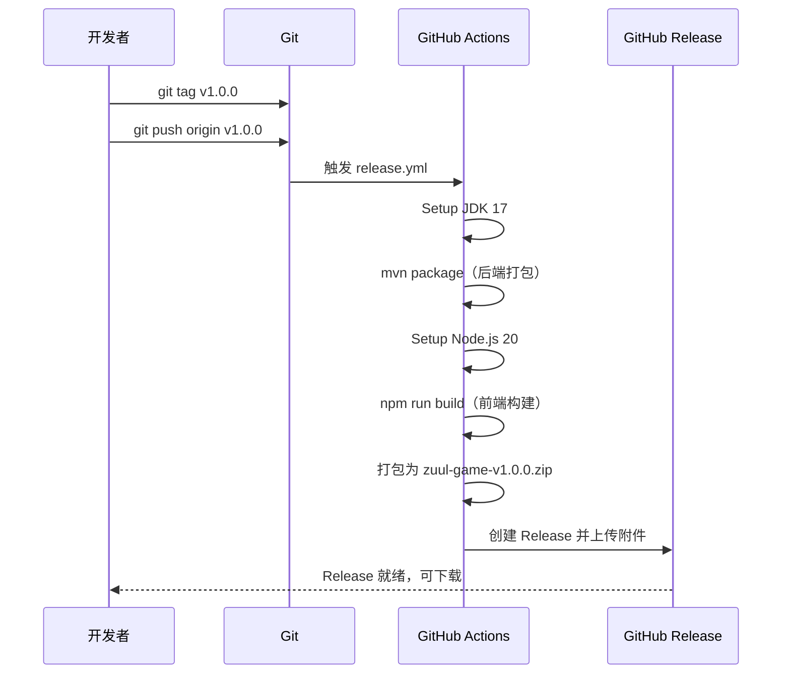

# 🚀 系统集成与发布部署方案

> 项目：Zuul Game（奇幻宅）
> 方案：GitHub Release 发布（方案A）
> 更新日期：2025-06-22

---

## 一、整体架构

### 1.1 系统组件关系

```
┌─────────────────────────────────────────────────────────┐
│                     GitHub 平台                          │
│                                                         │
│  ┌──────────┐    ┌──────────────┐    ┌───────────────┐  │
│  │ 源代码    │───▶│ CI 流水线     │───▶│ Release 发布  │  │
│  │ (Git)    │    │ (Actions)    │    │ (Tag 触发)    │  │
│  └──────────┘    └──────────────┘    └───────────────┘  │
│                        │                      │          │
│                        ▼                      ▼          │
│                 ┌──────────────┐    ┌───────────────┐  │
│                 │ 前端构建      │    │ 发布包 ZIP    │  │
│                 │ 后端打包      │    │ (可下载)      │  │
│                 └──────────────┘    └───────────────┘  │
└─────────────────────────────────────────────────────────┘
```

### 1.2 持续集成流程

```
[开发者推送代码] ──▶ [GitHub Actions 自动触发]
                              │
                    ┌─────────┴─────────┐
                    ▼                   ▼
            ┌──────────────┐   ┌──────────────┐
            │  PR 触发      │   │ push main 触发 │
            │  lint + build │   │ lint + build  │
            │  + security   │   │ + upload      │
            └──────────────┘   │   artifact    │
                               └──────────────┘
```

---

## 二、持续集成（CI）配置

**配置文件**：[`.github/workflows/build.yml`](../.github/workflows/build.yml)

### 触发条件
- `push` 到 `main` / `master` 分支
- `pull_request` 到 `main` / `master` / `develop` 分支

### Job 定义

| Job | 功能 | 构建产物 |
|-----|------|----------|
| `frontend-build` | Vue 3 + Vite 构建 | 上传 `frontend/dist` 为 artifact |
| `backend-build` | Maven 编译 + 测试 + 打包 | 上传 `target/*.jar` 为 artifact |

### 新增的 artifact 上传步骤

```yaml
# 前端构建产物（保存 7 天）
- name: Upload frontend artifact
  uses: actions/upload-artifact@v4
  with:
    name: frontend-dist
    path: frontend/dist
    retention-days: 7

# 后端 JAR 包（保存 7 天）
- name: Upload backend artifact
  uses: actions/upload-artifact@v4
  with:
    name: backend-jar
    path: backend/target/*.jar
    retention-days: 7
```

---

## 三、持续交付（CD）配置

**配置文件**：[`.github/workflows/release.yml`](../.github/workflows/release.yml)

### 触发条件
- 推送符合 `v*` 格式的 Git Tag（如 `v1.0.0`、`v2.1.0`）

### 工作流执行步骤



### 发布包结构

```
zuul-game-v1.0.0.zip
├── README.md                  # 项目说明
├── API.md                     # API 文档
├── plans/                     # 设计文档
│   ├── code-standards-summary.md
│   ├── database-schema.md
│   └── ...
├── backend/
│   └── zuul-springboot-1.0.0.jar    # Spring Boot 可执行 JAR
└── frontend/
    └── static/                       # 前端静态文件
        ├── index.html
        ├── assets/
        └── ...
```

---

## 四、发布版本命令

### 4.1 创建版本标签并推送

```bash
# 方式一：轻量标签
git tag v1.0.0
git push origin v1.0.0

# 方式二：附注标签（推荐，包含版本说明）
git tag -a v1.0.0 -m "Release version 1.0.0"
git push origin v1.0.0
```

### 4.2 查看发布结果

推送成功后：
1. 前往 GitHub 仓库 → **Actions** 标签页，查看 `Release` 工作流执行状态
2. 执行成功后，前往仓库主页右侧 → **Releases** → 查看最新 Release
3. 点击 `zuul-game-v1.0.0.zip` 即可下载

---

## 五、运行方式

### 5.1 下载后运行（老师检查方式）

```bash
# 1. 从 GitHub Releases 下载 zuul-game-v1.0.0.zip

# 2. 解压
unzip zuul-game-v1.0.0.zip -d zuul-game
# Windows 下：右键解压或使用 tar -xf

# 3. 启动后端服务（需要 Java 17+）
cd zuul-game
java -jar backend/zuul-springboot-1.0.0.jar

# 4. 打开浏览器访问
# http://localhost:8080/frontend/static/index.html
```

### 5.2 开发环境运行（IDEA 中演示）

```bash
# 终端 1：启动后端
cd backend
mvn spring-boot:run

# 终端 2：启动前端（开发服务器，支持热更新）
cd frontend
npm run dev

# 浏览器访问 http://localhost:5173
```

### 5.3 所需环境

| 环境 | 版本要求 | 验证命令 |
|------|----------|----------|
| Java | 17+ | `java -version` |
| Node.js | 18+ | `node -v` |
| Maven | 3.8+ | `mvn -v` |

---

## 六、与已有 CI 工作流的关系

```
┌─────────────────────────────────────────────────────────┐
│                    GitHub Actions 工作流                  │
├─────────────┬─────────────────┬─────────────────────────┤
│  lint.yml   │   build.yml     │    release.yml          │
│ (代码风格)   │  (构建 + 测试)   │    (发布 Release)       │
├─────────────┼─────────────────┼─────────────────────────┤
│ 触发方式     │ 触发方式         │ 触发方式                 │
│ push/PR     │ push/PR         │ git tag v*              │
├─────────────┼─────────────────┼─────────────────────────┤
│ ESLint      │ npm run build   │ mvn package             │
│ Prettier    │ mvn verify      │ npm run build           │
│ Checkstyle  │ upload artifact │ 打包 ZIP + 上传 Release  │
│ Commitlint  │                 │                         │
└─────────────┴─────────────────┴─────────────────────────┘
```

---

## 七、总结

| 环节 | 实现方式 | 配置文件 | 状态 |
|------|----------|----------|------|
| 🔨 持续集成 | 每次 push/PR 自动构建 + 测试 | [`build.yml`](../.github/workflows/build.yml) | ✅ 已完成 |
| 📤 构建产物 | Artifact 上传（保存 7 天） | [`build.yml`](../.github/workflows/build.yml) | ✅ 已添加 |
| 🏷️ 版本发布 | 推送 Git Tag 触发 Release | [`release.yml`](../.github/workflows/release.yml) | ✅ 已创建 |
| 📦 发布包 | ZIP 包（JAR + 前端静态文件） | [`release.yml`](../.github/workflows/release.yml) | ✅ 已配置 |
| 📋 发布日志 | CHANGELOG.md 自动引用 | [`CHANGELOG.md`](../CHANGELOG.md) | ✅ 已创建 |
| 🖥️ 本地运行 | `java -jar` + 浏览器访问 | — | 下载后即可运行 |

### 快速开始

```bash
# Step 1: 创建版本标签
git tag -a v1.0.0 -m "Release version 1.0.0"
git push origin v1.0.0

# Step 2: 等待 Actions 运行完成（约 3-5 分钟）

# Step 3: 在 GitHub Releases 页面下载 zuul-game-v1.0.0.zip

# Step 4: 解压后运行
java -jar backend/zuul-springboot-1.0.0.jar
# 浏览器打开 http://localhost:8080/frontend/static/index.html
```

---

> 本文档位于 `plans/deployment-summary.md`，可直接用于 PPT 素材或项目文档。
